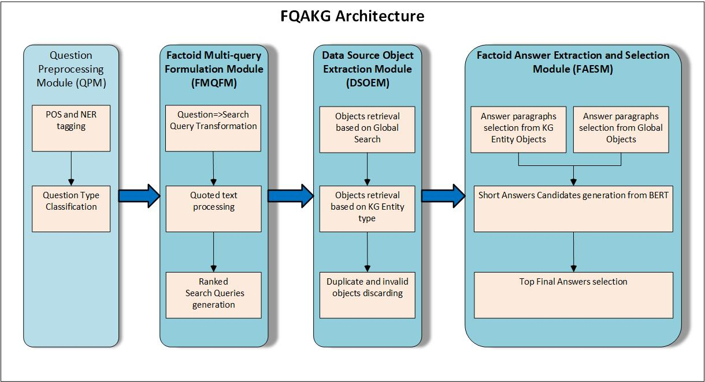

# nlp-question-answering
## Overview
This package implements an automated question-answering system, Factoid Question Answering using Knowledge Graph (FQAKG),
that leverages large Knowledge Graphs (KG) and Deep Learning techniques to identify concise answers to factoid-type
questions from any domain. The KG used for this system is Google KG – an online Web Service that provides API
for accessing Web data as structured entities. The Deep Learning system of choice is BERT – one of Google’s latest 
advancements in NLP. 

The FQAKG system is designed as pipeline of connected modules, each responsible for some processing:



### FQAKG Modules
#### 1. QUESTION PRE-PROCESSING MODULE (QPM.py)
QPM module is responsible for initial text pre-processing as following:
1. Detects parts of speech for every word in the query.
2. Removes stop-words.
3. Detects named entities such as geographical locations.
4. Determines whether a query is a simple fact or not. A query is considered a simple fact if it contains 1 or less 
verbs and less than 6 words.
5. Whther the query expects a numerical answer, e.g. a query "How many inches in a foot" would be expecting a numerical answer.

#### 2. FACTOID MULTI-QUERY FORMULATION MODULE (FMQFM.py)
FMQFM module responsible for formulating multiple queries for KG search engines:
1. Transforms query terms into likely answer form.
2. Query tokenization.
3. Builds ranked search queries for KG engines.

#### 3. DATA SOURCE OBJECT EXTRACTION MODULE (DSOEM.py)
DSOEM module is responsible for calling 3rd party search engines API and collecting data source objects from them:
1. For boolean queries, use global search KG Search APIs.
2. For named entity queries, use KG Entity type APIs when available.

#### 4. FACTOID ANSWER EXTRACTION AND SELECTION MODULE (FAESM.py)
FAESM module is responsible for generating final short answers for the original query:
1. Selects answer paragraphs from data source objects retrives by DSOEM module.
2. Processes them with BERT QA Service, to obtain short answers.
3. Selects top answers from BERT results.

## Installation
This package can be used in 2 ways: using docker or directly using python3.

### Using Python3
1. Ensure that you have python3 installed on your system.
2. Install prerequisites: ```sudo apt-get install libmysqlclient-dev```
3. Install following python packages: ```pip3 install word2number gitpython progressbar colorama pattern google-api-python-client requests_cache sklearn websocket_client```
4. Install nltk: ```pip3 install --user -U nltk```
5. Download ntlk's stopwords and punkt data packages: see https://www.nltk.org/data.html.
6. Get this git repository
7. Run setup script: ```python3 setup_env.py```

#### Installing BERT
Using BERT requires additional installation steps
1. Install python3.6 (http://lavatechtechnology.com/post/install-python-35-36-and-37-on-ubuntu-2004/) and
pip3.6 (https://askubuntu.com/questions/889535/how-to-install-pip-for-python-3-6-on-ubuntu-16-10)
2. install dependant packages: ```pip3.6 install numpy tensorflow==1.15 websocket_server```
3. Clone BERT QA Service project from https://github.com/ekegulskiy/bert-qa-srv.git
4. Obtain uncased_L-12_H-768_A-12.zip package from the repository owner and unzip to some folder. Export BERT_BASE_DIR 
env variable to point to this folder.   
5. Obtain BERT fine-tuned model for question answering from the repository maintainer and store it in the 'output' 
sub-folder of BERT QA Service project.

### Using docker 
1. Ensure you have docker installed on your system
2. Download Dockerfile from this repository
3. Build docker image by running: "docker build -t nlp-question-answering ."
4. Run docker container by running: "docker run -it nlp-question-answering"

## Usage
The system is designed to provide learning experience for building Question Answering systems, by allowing to run 
individual modules of the Question Answering pipeline and improve or substitute them with others.
The module to run is specified via the parameter, as well as the question to be processed.
For example, to run 1st module of the pipeline, the following command can be used:
```
>python3 module_run.py --module=1 --question="How tall is Mount McKinley?"
```
For a list of available arguments, run:
```
>python3 module_run.py --help
```
To run BERT QA Service, execute the following commmand from the BERT QA Service project folder:
```python3.6 run_squad.py --vocab_file=$BERT_BASE_DIR/vocab.txt   --bert_config_file=$BERT_BASE_DIR/bert_config.json   
--init_checkpoint=$BERT_BASE_DIR/bert_model.ckpt   --do_train=False   --train_file=$SQUAD_DIR/train-v1.1.json   
--do_predict=True   --predict_file=$SQUAD_DIR/dev-v1.1.json   --train_batch_size=12   --learning_rate=3e-5   
--num_train_epochs=2.0   --max_seq_length=384   --doc_stride=128   --output_dir=./output```


